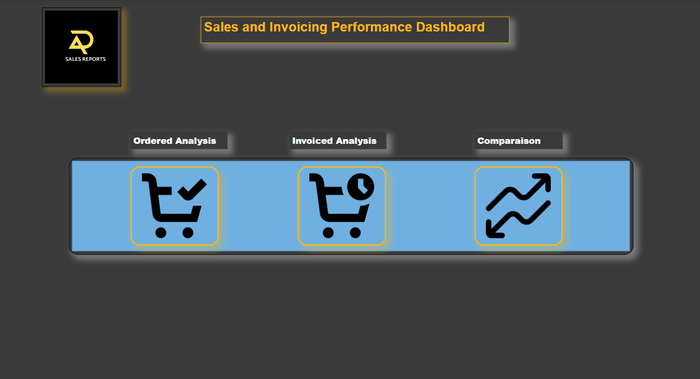
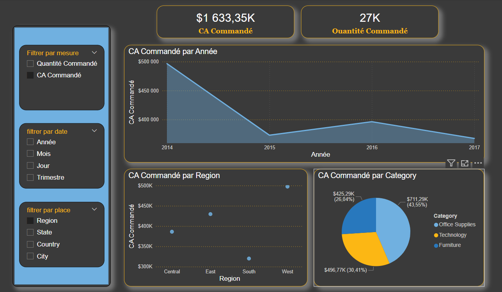
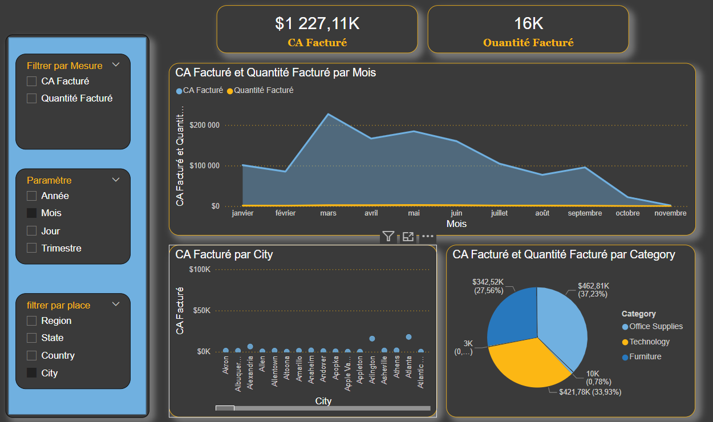
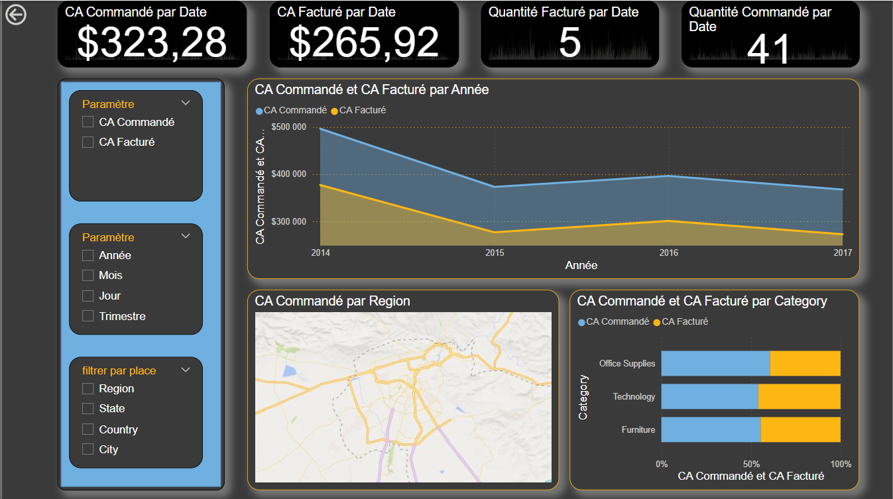

# Invoicing and Orders Analysis Dashboard

## Overview
This dashboard provides an interactive comparison between invoicing and orders, allowing users to analyze invoiced revenue, ordered revenue, and corresponding quantities. It offers insights to support business decision-making by identifying trends, monitoring KPIs, and highlighting discrepancies between orders and invoicing.

## Objectives
- **Analyze Orders**: Examine ordered revenue and quantity.
- **Evaluate Invoicing**: Track invoiced revenue and quantity metrics.
- **Compare Orders vs. Invoicing**: Contrast invoicing metrics with order metrics to identify potential gaps or delays.
- **Support Decision-Making**: Provide insights to optimize sales and fulfillment processes.

## Dashboard Structure

### Page 1: Menu
- **Navigation**: Select between pages for order analysis, invoicing analysis, and comparative analysis.
  

### Page 2: Order Analysis
- **Ordered Revenue**: Displays total revenue based on orders.
- **Ordered Quantity**: Shows total quantity ordered over selected time frames.

### Page 3: Invoicing Analysis
- **Invoiced Revenue**: Shows the revenue captured from invoiced sales.
- **Invoiced Quantity**: Displays the total quantity invoiced, offering insights into fulfillment.

### Page 4: Comparison of Invoicing vs. Orders
- **Revenue Comparison**: Compares invoiced revenue to ordered revenue, highlighting potential discrepancies.
- **Quantity Comparison**: Contrasts invoiced quantities with ordered quantities to monitor fulfillment gaps.

## How to Use

1. **Access the Dashboard**:
   - **Local Deployment**: Set up the dashboard locally following provided setup instructions.
   - **Web-Based Deployment**: Access the dashboard online through the provided URL.

2. **Explore the Dashboard**:
   - **Navigate Between Pages**: Use the menu to switch between pages.
   - **Filter Data**: Apply filters to focus on specific segments, dates, or products.
   - **Interact with Visualizations**: Hover over data points and click on chart segments to reveal more details.
   - **Export Data**: Export data for further analysis if needed.

## Technical Details
- **Programming Language**: (Specify language used, e.g., Python, R)
- **Data Visualization Library**: (Specify library, e.g., Power BI, Plotly)
- **Data Source**: (Specify data source, e.g., database, CSV file)

## Contributing
To contribute to this project, please follow these steps:

1. Fork the repository.
2. Create a new branch for your feature or bug fix.
3. Make your changes and commit them.
4. Push your changes to your forked repository.
5. Submit a pull request.

---

This README file is structured to guide users in understanding and using the dashboard effectively, with images that demonstrate the functionality of each page.
